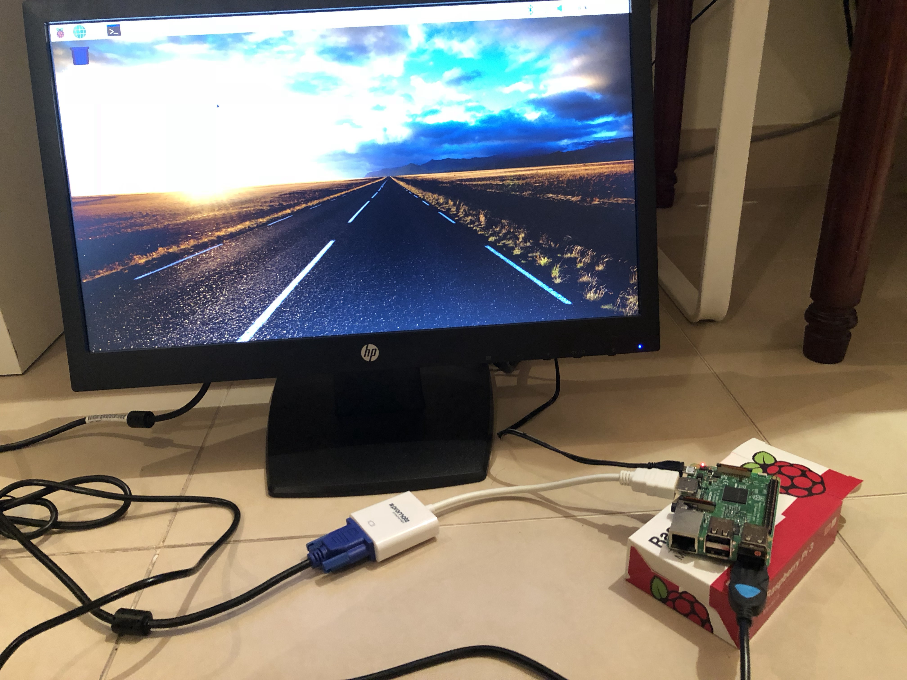
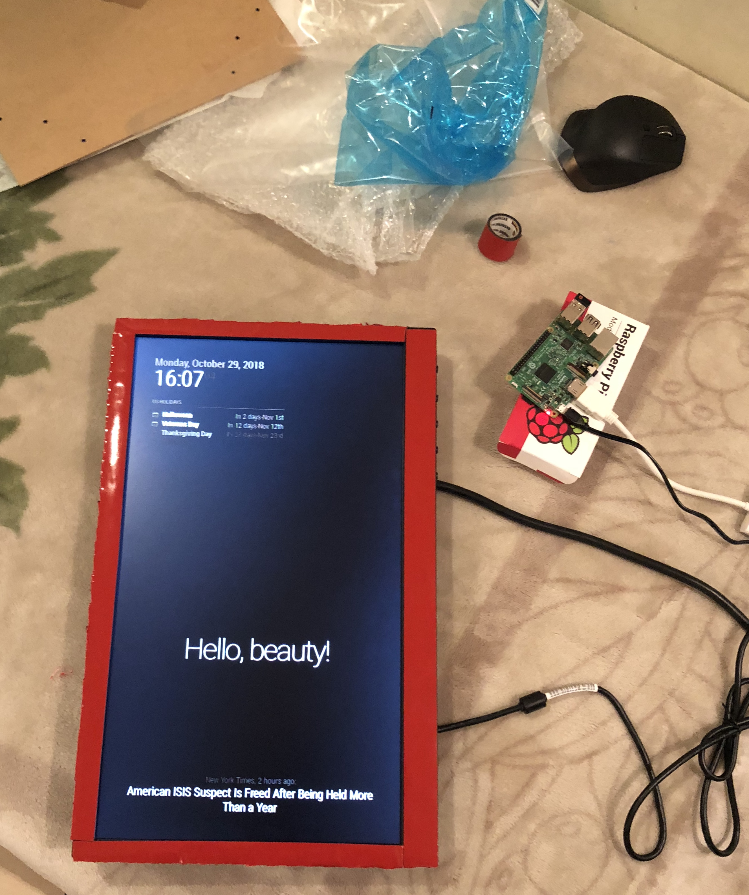
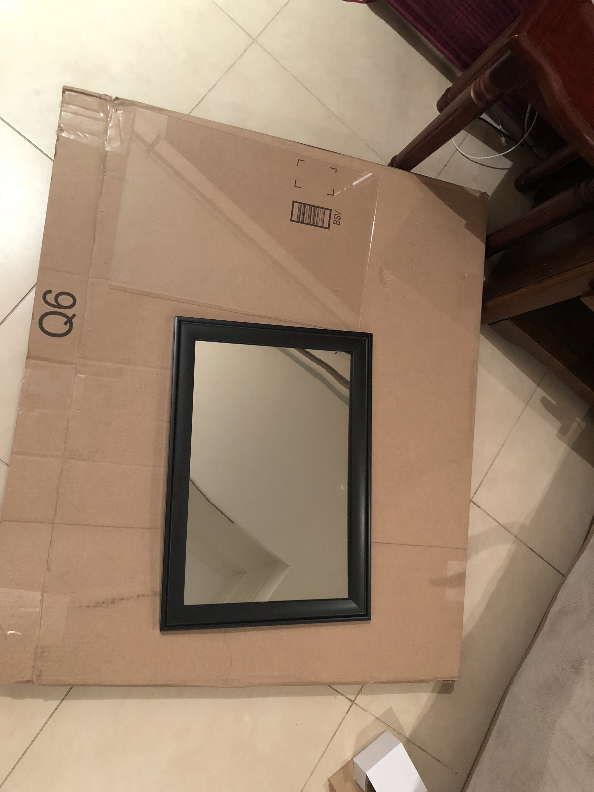
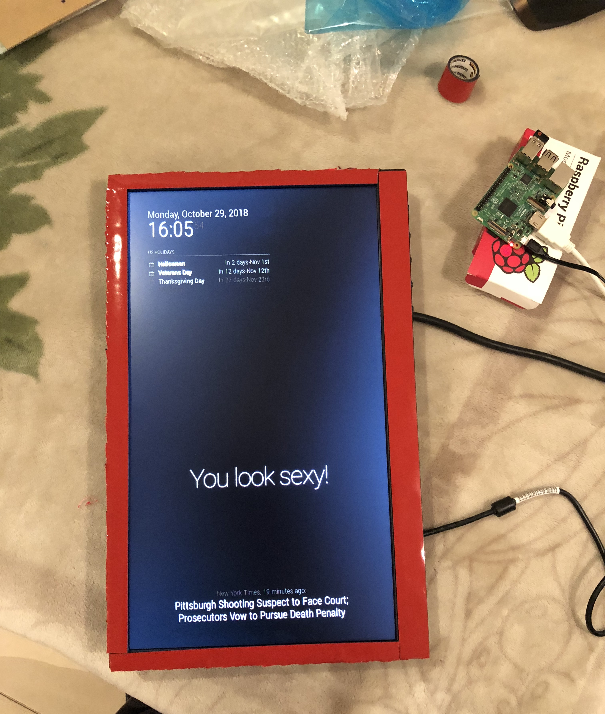
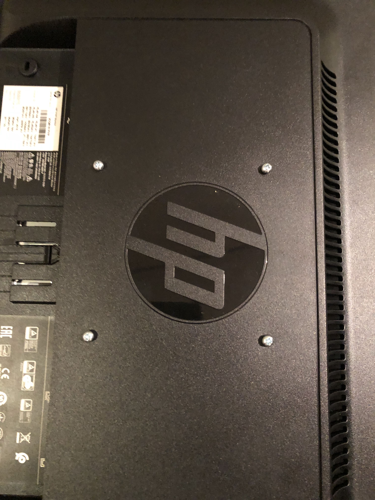

# Smart Mirror Project (Grade 10 MYP Personal Project)

**Author:** Abdul Khurram  
**Date:** 2018-2019  
**School:** Emirates International School Jumeirah

---

## Project Overview

This Smart Mirror project, developed during my Grade 10 MYP Personal Project, involved the creation of an **embedded IoT system** using a **Raspberry Pi 3 (Model B)** as the core microcontroller. The goal was to design a fully-functional **smart mirror** that could display real-time data, including time, date, weather updates, and news headlines, using a combination of **Python scripting**, **MagicMirror²** open-source software, and a **Linux-based environment**. 

This project provided me with the opportunity to work extensively on both the **hardware and software** sides of development, integrating **GPIO** for peripheral interfacing, and handling **data-driven content** through API calls to external sources for real-time updates. The final product was showcased at my school’s exhibition and was well-received for its innovation and functionality.

  

## Technical Stack

- **Microcontroller**: Raspberry Pi 3 (Model B)
- **Programming Language**: Python (for configuring modules, GPIO integration)
- **Software Stack**: MagicMirror² (Node.js-based framework)
- **Operating System**: Raspbian (Linux Debian distribution)
- **Display**: HP Monitor paired with a two-way mirror
- **Hardware Mounting**: Custom 3D-printed mount for efficient hardware organization
- **Data Integration**: RESTful API requests to fetch dynamic data such as weather and news headlines
- **Networking**: SSH and SCP for remote configuration and system updates
- **Power Management**: Integrated UPS for consistent power supply during software upgrades

## Development and Assembly Process

The development involved connecting the **Raspberry Pi’s GPIO pins** to external sensors and interfacing with the monitor through HDMI. A two-way mirror was then used to overlay the **LCD display**, allowing the widgets and information to appear directly on the reflective surface. MagicMirror² provided the foundation for the **Node.js** modules that displayed real-time data on the interface.

The hardware assembly required designing a clean and effective setup behind the mirror, which led to the creation of a **3D-printed mount** to house the Raspberry Pi and ensure all components were neatly secured.

  

## System Optimization

To ensure efficient data processing and display updates, the **software stack** was optimized to minimize latency, particularly during **HTTP API requests** for weather and news data. The project also involved configuring **systemd services** to auto-launch the MagicMirror² application on boot and **cron jobs** for system maintenance, including clearing cache and updating modules periodically.

  

## Technical Challenges and Solutions

- **Hardware Integration**: Ensuring stable connections between the Raspberry Pi and the display required **GPIO management** and secure interfacing with peripherals. A 3D-printed mount was designed to streamline cable management and securely hold all components.
- **Software Configuration**: The project involved SSH-based remote configuration, where I accessed the Raspberry Pi via terminal to update configurations for screen resolution, backlight control, and adjusting **system performance** through **overclocking**.
- **Display and User Interface**: The MagicMirror² interface was customized using **HTML/CSS** to match the aesthetic requirements of the project, ensuring clarity and responsiveness on the LCD display.

  

## Embedded System Contributions

The embedded system design process emphasized real-world problem-solving, from **circuit design** to software integration. By utilizing a **Linux-based OS**, I worked directly with the **kernel** to manage system processes and services that supported the smooth operation of the smart mirror interface. The modular architecture of MagicMirror² allowed for the integration of third-party modules, expanding the capabilities of the system in terms of widget interaction and real-time feedback.

## Reflection

This project served as an introduction to **embedded systems**, combining my passion for hardware interfacing and software development. Through configuring the Raspberry Pi, designing custom hardware solutions, and handling real-time data processing, I gained valuable hands-on experience in **systems integration**, **embedded Linux**, and **IoT** solutions. These skills continue to influence my current academic and professional work in computer science and embedded systems.

  

## Conclusion

The Smart Mirror project was a comprehensive demonstration of my ability to integrate software with physical systems, combining principles of **embedded system design**, **networking**, and **full-stack development**. It marked the beginning of my journey into the field of technology and continues to be a key talking point in my pursuit of embedded systems and IoT-related internships.